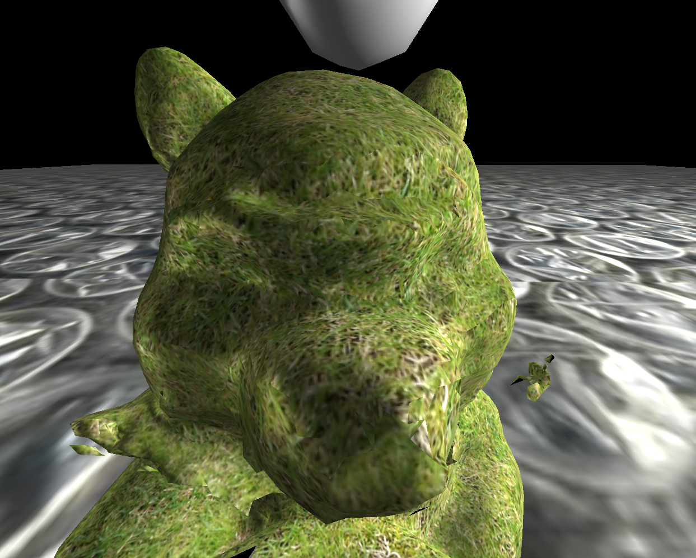
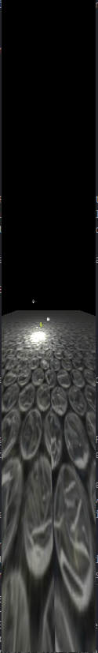
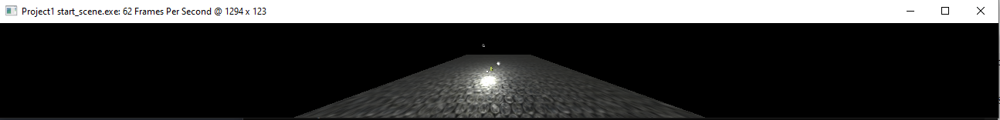
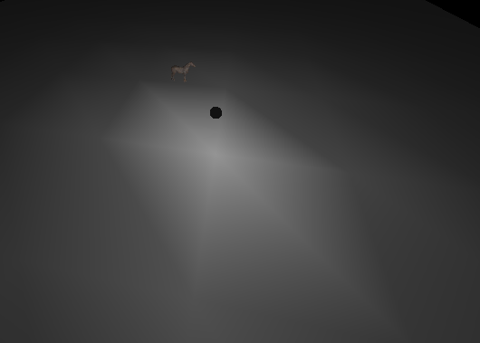
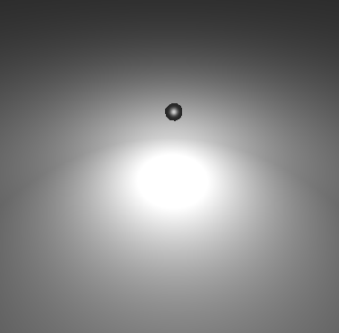
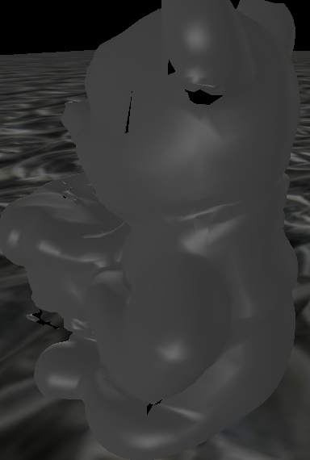
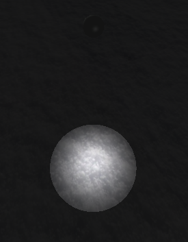

# Edward Yamamoto (22709905)
*All parts of the project were successfully completed*

*The version of the program that uses vertex shading is in the folder `old-code`*

# A

## Function

- Left Mouse Button

  - Horizontal: Rotate the camera horizontally about the origin
  - Vertical: Zoom in/out when moving up/down with respect to the screen

- Middle Mouse Button
  - Horizontal: Rotate the camera horizontally about the origin
  - Vertical: Rotate the camera vertically about the origin

## Implementation

```C++
    const vec4 eye = {X, Y, Z, 1};
    const vec4 center = {0, 0, 0, 1};
    const vec4 up = {0, 1, 0, 0};

    view = LookAt(eye, center, up);
```

The variables `camRotSidewaysDeg` and `camRotUpAndOverDeg` are automatically
set by program when moving the mouse while clicking. By using
a sperical coordinate system it is possible to turn these angles into cartesian
coordinates. These coordinates are then used with the inbuilt `LookAt()`
function inside the display callback to set the view matrix.

Because the `up` vector is constant, an issue arises when `camRotUpAndOverDeg`
exceeds +-90 degrees. At this angle of rotation, the `up` vector is incorrect and
the camera flips. To prevent the camera from being rotated beyond +-90 degrees,
the values were clamped between +-88 degrees.

# B

## Function

The program now allows the user to change the scale, rotation and position of
objects in the scene.

## Implementation

Using the scene object variables, the program constructs a matrix that performs
the rotations, scale and translations required to get the object into the
correct position. The position and rotation variables are set by the program
during runtime.

To do this, several transformations are applied in order

1. `RotateX(sceneObj.angles[0])`
2. `RotateY(sceneObj.angles[1])`
3. `RotateZ(sceneObj.angles[2])`
4. `Scale(sceneObj.scale)`
5. `Translate(sceneObj.loc)`

The order here is quite important. While the rotations and scaling can occur in
any order, the translation must occur last as the rotations and scaling must
be performed at the origin for correct results.

- Left Mouse Button

  - Horizontal: Rotate object parallel to the y-axis
  - Vertical: Rotate object about the x-axis

- Middle Mouse Button
  - Horizontal: Rotate object about the z-axis
  - Vertical: Increases/decrases the texture scale

# C

## Function

Adjust the way light interacts with an object by adjusting the diffuse, specular
and ambient properties. Also enable movement of the light source.

## Implementation

Mainly, I simply used the functions with the prefix `adjust` to modify the
parameters. Most of the mouse movement quantisation was done already and all
that I had to do was use the two values passed into the function I was modifying.

### Light Source Controls

- Left Mouse Button

  - Both: Move the light source in the direction of the mouse movement

- Middle Mouse Button
  - Horizontal: Increase/decrease the brightness of the light
  - Vertical: Move the light parallel to the y-axis (up/down)

### Object Controls

- Left Mouse Button

  - Horizontal: Adjust ambient lighting (left is decrease and right is increase)
  - Vertical: Adjust diffuse lighting (up is increase and down is decrease)

- Middle Mouse Button
  - Horizontal: Adjust shine value (left is decreas and right is increase)
  - Vertical: Adjsut specular lighting (up is increase and down is decrease)

_Note - all of these values are clamped between 0.0 and 100.0 which I thought were
reasonable limits for this program._

# D


## Function

Allow objects to be viewed more closely

## Implementation

To do this, I swapped out the `Frustrum()` for the `Perspective()` function
in the reshape callback, andadjusted the near-plane constant to a smaller value. This prevented the
premature clipping of the object mesh when the camera got too close.

To be honest, I know that you can achieve the same effect with just the frustrum
but I found the `Perspective()` function easier to understand in the code -
especially for explaining part E.

# E



## Function

Maintain a constant viewbox after the screen stops becoming square after resizing.

## Implementation

After the screen stops becomming a square, the FOV adapts so that the content on
the screen does not change. To do this I modified the reshape function.

The main way that I implemented this was to make the FOV dependant on the
aspect ratio of the screen. So, if your screen width increases, then to keep the
same amount of stuff on the screen, the FOV variable must change to compensate.

This FOV variable is adjusted in both the x and y direction depending on if the
width is greater than the height. If the width is greater than the height, we
will adjsut the FOV in the x-direction, otherwise we will modify the FOV in the
y-direction.

In the case the the height is less than the width,
I simply switch the components in the view matrix that
correspond to the FOV transofmations. This is essentially how I calculate the
FOV in the y-direction when height is less than width (normally FOV is assumed to
be in the x-direction).

# F

## Function

Implement light falloff in the vertex shader

## Implementation

I added a function in the vertex shader that takes the vector from the
light-source to the vertex and produces an intensity vector. This intensity
vector is multiplied with the ambient, diffuse and specular components to
produce the effect of light falling off with distance. Light falls of with the
inverse square law. To get more good-looking results, I used the following
attenuation equation,

```C++
float distance = length(lightVector);
float csrc = 50.0; // source intensity
float kc = 5.0; // constant attenuation
float kl = 1.0; // linear attenuation
float kq = 1.0; // quadratic attenuation
float intensity = csrc / (kc + kl * distance + kq * distance * distance);
return vec3(intensity, intensity, intensity);
```

# G


## Function

Move the lighting from the vertex shader to the fragment shader

## Implementation

The lighting in the vertex shader was very patchy. For example, when you move the light the circle of light underneath it changes its shape as it moves over the plane. This is because the plane is very low-poly and does not allow for accurate lighting calcualtions.

To solve this, I simply moved the color calculations over to the fragment
shader. The vertex shader only exists to pass the normal, eye and light
vectors to the fragment shader.

This change makes moving light very smooth. As you can see in the picture.

# H

## Function

Add a specular component to the lighting and make it tend towards white rather
than the colour of the object.

## Implementation

Specular reflection was caluclated according to the equation,

```C++
float n = Shininess;
vec3 reflection = reflect(light, normal);
float cosTheta = clamp(dot(reflection, eye), 0.0, 1.0);
float specularCoefficient = pow(cosTheta, n);
if (dot(light, normal) < 0.0 ) {
  specularCoefficient = 0.0;
} 
return specularCoefficient;
```

Increasing values of `n` increase the amount of specular highlighting
that occurs. This specular equation is designed to blow up then the
eye is in the same direction to the reflected vector. And if the light source is
not in front of the vertex, then specular is set to 0.

To get the specular component tending towerds white.I simply created a constant
colour vector which contained the elements `{0.1,0.1,0.1}` which will be scaled by the
specular coefficient. By having each colour component the same, I could make the
specular component always be white.

# I

## Function

Add a directional light to the scene

## Implementation

The directional light appears as a big sphere, and its direction of
illumination can be controlled by moving it around the world. Its
direction is the vector between the lights position and the origin.

When adding multiple lights it was important to have separate color
vectors as each light has its own modifiable color. Early on I had
a bug where turning one light green turned all of them green.

The program correctly allows each light to have its own separate RGB
values which affect the final render.

# J


## Function

1. Duplicate and delete scene objects
2. Add a spot light to the scene

## Implementation

Users can delete any object that they want from a dropdown menu. However,
users can not delete any of the light sources or ground planes.
Similarly, you can duplicate any object on the screen from a drop-down.

The spot-light can have both its position and direction changed.
Its lighting angle is set at 15 degrees and can not be changed.
Its position is set identically to the other lights as described earlier.
And its direction is set by rotating the object like you would any other
object.

The light for the spotlight is brightest at the center and falls off at the edges.
